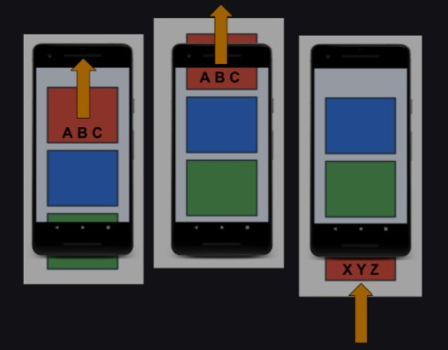
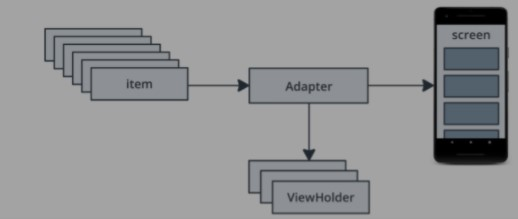

# Affirmations
This is android app to keep you motivated with inspiring text "quotes" and images.

*App that displays a scrollable list of inspiring text and images using the RecyclerView widget in Android.
*Added Adaptive icon (v26).
*Added Themes and Cards Layout from Material Design Components Library.

###RecyclerView

If you think about the apps you commonly use on your phone, almost every single app has at least one list. The call history screen, the contacts app, and your favorite social media app all display a list of data. As shown in the screenshot below, some of these apps display a simple list of words or phrases, where others display more complex items such as cards that include text and images. No matter what the content is, displaying a list of data is one of the most common UI tasks in Android.

To help you build apps with lists, Android provides the RecyclerView. RecyclerView is designed to be very efficient, even with large lists, by reusing, or recycling, the views that have scrolled off the screen. When a list item is scrolled off the screen, RecyclerView reuses that view for the next list item about to be displayed. That means, the item is filled with new content that scrolls onto the screen. This RecyclerView behavior saves a lot of processing time and helps lists scroll more smoothly.

In the sequence shown below, you can see that one view has been filled with data, ABC. After that view scrolls off the screen, RecyclerView reuses the view for new data, XYZ.

        
        

  There are a number of pieces involved in creating and using a RecyclerView. 
  The diagram below shows an overview, and you will learn more about each piece as you implement it.

        *item - One data item of the list to display. Represents one Affirmation object in your app.
        *Adapter - Takes data and prepares it for RecyclerView to display.
        *ViewHolders - A pool of views for RecyclerView to use and reuse to display affirmations.
        *RecyclerView - Views on screen
        

        
        

        
Here is a short video of running app:
<table cellpadding="0" cellspacing="0" border="0" width="100%">
  <tr>
    <td align="center">
      <figure class="video_container">
        <iframe src="app_video/affirmations.mp4" frameborder="0" allowfullscreen="true"> </iframe>
      </figure>
    </td>
  </tr>
</table>
